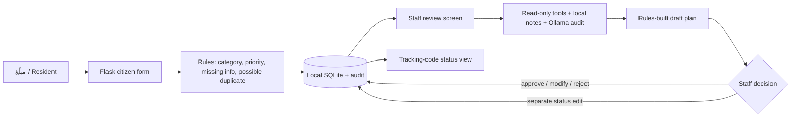

# BALAGH for SAIF 2026 — evidence and demo pack

Prepared 30 September 2026. This is submission preparation, **not** an organizer submission. Keep verified organizer requirements separate from the recommendations below.

## Verified competition information (accessed 30 September 2026)

| Verified fact | Official source | Limit |
| --- | --- | --- |
| Fields include **الابتكارات الحكومية والخدمات الرقمية** (Government Innovation and Digital Services) and **الذكاء الاصطناعي وعلوم البيانات** (AI and Data Science). | [SAIF homepage, fields](https://saifair.sa/#fields) | The site does not rank fields for BALAGH. |
| Public journey: registration closes **1 October 2026**; qualifiers announced **4 October**; in-person Riyadh event **24–26 November 2026**. | [SAIF homepage, journey](https://saifair.sa/#journey) | No time of day or separate project-upload deadline was visible. |
| Judging criteria include innovation, impact, feasibility, and technical quality. | [Official terms, section 4](https://saifair.sa/terms?doc=terms) | No scoring weights visible. |
| Terms allow an individual or a team under the announced categories and place accuracy of submitted information on the participant. | [Official terms, sections 2–3](https://saifair.sa/terms?doc=terms) | No maximum team size or final team-composition rules visible there. |
| Public registration asks for personal/account fields and says an added member must be in the same age category. Its sign-in link leads to the participant portal. | [Registration](https://saifair.sa/register), [participant portal sign-in](https://tahkeem.tuwaiq.edu.sa/saif) | The actual project submission form is behind sign-in. No account credentials or organizer instructions were provided for this audit. |

**Unverified, do not guess:** project submission fields, required file types/sizes, team size and final eligibility details, pitch/poster format, and project submission deadline. The user has offered to provide portal details; update this section from that evidence before uploading anything. The public **registration** date is not necessarily the project-upload date.

## Concise repository audit

At commit `af14b8b` before these changes, Flask exposes citizen submit/result/track routes and staff login/dashboard/report/review routes. `triage.py` classifies by explicit rules, assigns priority, identifies missing information, and compares open reports. `database.py` writes reports, recommendations, status changes, and audit history to local SQLite. `agents.py` uses LangGraph Functional API with read-only tools (`load_case_record`, `search_similar_cases`, `retrieve_official_guidance`, `recall_human_review_memory`), a local Ollama chat model, retrieval from the three checked-in notes, `interrupt()` for staff review, and `Command(resume=...)` for the decision. No tool executes a municipal action. See `src/balagh/` and `tests/`.

**One report end to end:** citizen POST validates text/image, runs rules against open cases, stores a report and hashed tracking token, then shows the code. Staff login opens the saved case and rules result. Staff may request the LangGraph draft; a read-only model audit and locally retrieved notes are saved as **pending**. Staff approve, modify with a note, or reject; the workflow resumes and the decision is logged. Staff can separately change status; the citizen can view that status with the tracking code. Following a process restart, a pending draft loses its in-memory checkpoint; review fails without saving a decision, and staff can discard the draft and regenerate it. The discard is audited.

**Demonstrated:** 47 automated tests pass; a local HTTP GET to `/citizen/` returned 200 with Arabic content and a CSRF token; a real `qwen3:4b-instruct` + `nomic-embed-text` synthetic smoke run completed a draft and staff rejection. **Mocked by tests:** most model outputs and source retrieval in the workflow test. **Not established:** real-report accuracy, production impact, live LangSmith trace, government integration, load/security review, or reliable model latency distribution. The original multi-call supervisor/coordinator smoke run invented a department and location detail. The current workflow selects the audit worker from checked rules and builds the operational plan from stored case facts; it keeps the model’s advisory audit and staff review.

## Field, users, and differentiation

**Recommended primary field:** Government Innovation and Digital Services. BALAGH’s unit of value is a staff review workflow for a public service, not a new model. AI and Data Science is a secondary technical description. This is a recommendation, not an organizer rule.

**العربية:** المبلّغ يريد إيصال مشكلة مرفق عام ومتابعتها؛ الموظف يحتاج فرز البلاغات الناقصة أو الغامضة أو العاجلة أو المتشابهة قبل اتخاذ إجراء. بلاغ يعرض اقتراحًا أوليًا واضحًا، يطلب التفاصيل الناقصة، ويُظهر المراجع والمخاطر للموظف. الاعتماد وتغيير الحالة بيد الموظف.

**English:** Residents need a clear way to describe and follow a public-facility issue. Staff need help reviewing incomplete, ambiguous, urgent, and possible duplicate reports. BALAGH supplies an inspectable suggestion and missing-information checklist; a person makes the operational decision.

[Balady’s reporting service](https://balady.gov.sa/ar/services/تقديم-بلاغ) already supports categorized municipal reports, location, description, and images. [Riyadh 940](https://www.alriyadh.gov.sa/ar/services/3?mainServiceCode=19) already receives and routes reports. BALAGH is a local staff-triage experiment that could inform better review of these case types. It is **not** affiliated with, integrated into, or a replacement for either channel. Its novelty claim is the review aid and human-control flow, not a new citizen reporting channel or proven efficiency gain.

## Problem / solution / human control

The LangGraph interruption makes the staff decision a required step in the advisory run. It does not substitute for operational authority. The simplified routing avoids a model-only misroute observed in the first smoke run. There is **no measured evidence** that multiple model agents improve accuracy or speed here, so the former model supervisor and coordinator calls were removed. The remaining named worker prompts use one audit worker selected by the rules. A simpler one-model baseline across all labelled cases remains unmeasured.

## Measured results (30 September 2026)

| Metric | Rules on 18 synthetic labelled cases | Current agent workflow | Caveat |
| --- | ---: | ---: | --- |
| Category / prototype queue accuracy | 17/18 / 17/18 | Not measured | E11 mixed issue misclassified. |
| Urgent recall / false-positive rate | 3/3 / 0/15 | Not measured | `Critical` is a rules output. |
| Duplicate precision / recall | 1/1 / 1/1 | Not measured | Only one positive pair. |
| Ambiguous abstention | 2/3 | Not measured | E11 forced into Waste & Cleanliness. |
| Successful full workflow | Not applicable | 1/1 final synthetic run | Model draft plus staff rejection/resume, isolated DB. |
| Source link provenance | Not applicable | 3/3 retrieved ID/URL pairs matched local notes | Claim-level citation correctness unmeasured. |
| Median / p95 latency | 0.784 / 2.981 ms | Not measured | Rules: 18 single calls; agent: one final run at 8.322 s draft + 0.012 s resume. |

The first complex smoke run took 21.317 s and contained unsupported details; a simplified smoke run took 10.019 s, and the [final smoke](evidence/ollama_final_smoke.json) took 8.322 s. These are different runs with warmed models and changed code, not a controlled speed comparison. See [evaluation protocol](EVALUATION.md), [cases](../evaluation/arabic_cases.json), and `scripts/smoke_real_ollama.py`. No result here supports a production impact percentage.

## Three-minute demo and fallback recording plan

Before presenting, run the [README commands](../README.md), keep the generated staff code out of the recording, and open an authenticated staff tab. The demo seed is synthetic and distinct from the evaluation set. Submit the **same** synthetic title, description, city, district, and landmark as `scripts/seed_demo.py` to show a possible duplicate; keep the report tracking code visible only in the local demo. The AI review needs both Ollama models already loaded.

| Time | On-screen action | What to say |
| --- | --- | --- |
| 0:00–0:35 | Citizen submits the synthetic report. | “هذه بيانات تجريبية؛ يحصل المبلّغ على رمز متابعة.” |
| 0:35–1:05 | Result shows suggested category/priority and potential duplicate; open tracking. | “هذا فرز أولي، وليس قرار إحالة.” |
| 1:05–1:35 | Staff opens report, shows missing info, duplicate candidate, and history. | “الموظف يراجع المشكلة والموقع قبل الربط.” |
| 1:35–2:20 | Run Ollama review; open retrieved excerpts and original links. | “هذه مراجعة نموذج وخطة مبنية على قواعد؛ كل مصدر قابل للفحص.” |
| 2:20–2:45 | Staff rejects or modifies with a note; show audit history. | “القرار البشري مسجل ولا ينفذ النموذج إجراء.” |
| 2:45–3:00 | Staff updates status, then citizen tracking refreshes. | “الحالة المؤكدة منفصلة عن الاقتراح.” |

**Fallback recording plan:** capture one continuous successful 3-minute local session with screen recorder before the judging session, including the Ollama review and the staff decision; show the model names and synthetic-data label at the start. Keep the original uncut capture and a trimmed MP4 available locally, with no staff code or real personal data visible. If Ollama fails live, play that labelled recording and state that it is a previous run. If no verified recording exists, demonstrate only the deterministic rules, staff status/history, and tracking, explicitly call it a **rules fallback**, and omit any claim of live AI or retrieved model evidence. A fallback MP4 is **not included** in this repository; it still needs to be recorded on the presentation machine.

## Three-minute Arabic pitch script

**0:00–0:35** — «المشكلة ليست نقص قناة بلاغ جديدة؛ توجد قنوات رسمية. الصعوبة التشغيلية هي بلاغ ناقص أو غامض أو عاجل أو يشبه بلاغًا آخر. قد يضيع وقت المراجع في فهمه، وقد يوحي التصنيف الأولي بيقين غير موجود.»

**0:35–1:10** — «بلاغ نموذج محلي يكتب فيه المبلّغ وصف المشكلة وموقعها ويحصل على رمز متابعة. القواعد تعرض تصنيفًا وأولوية مقترحين، وتنبّه إلى المعلومات الناقصة أو التشابه المحتمل. لا يغلق التشابه أي بلاغ تلقائيًا.»

**1:10–1:50** — «في شاشة الموظف، أطلب مراجعة نموذج Ollama محلي. تقرأ الأدوات الحالة والمراجع فقط. تظهر خلاصة تحليلية، وتبنى خطة الإجراء من حقائق البلاغ والقواعد حتى لا يخترع النموذج موقعًا أو صلاحية جهة. أستطيع فتح الملاحظات المصدرية وروابطها. يتوقف المسار قبل اعتماد الموظف.»

**1:50–2:25** — «الموظف يقبل أو يعدّل أو يرفض، ويسجل السبب؛ وتغيير الحالة إجراء منفصل. عند فشل النموذج يبقى الفرز الحتمي متاحًا. وإذا فقد الخادم حالة استئناف توصية معلقة، لا يسجل قرارًا زائفًا، بل يمكن استبعاد المسودة وإعادتها.»

**2:25–3:00** — «اختبرنا 18 حالة عربية مصطنعة: تطابق التصنيف والمسار في 17، واكتشاف الحالات العاجلة في 3 من 3، لكن حالة تجمع نفايات وحفرة ما زالت تحتاج تحسينًا. هذه نتائج مجموعة صغيرة، لا دليل على أثر إنتاجي. نرى الملاءمة الأساسية في الابتكارات الحكومية والخدمات الرقمية: رفع جودة مراجعة الموظف مع إبقاء الإنسان صاحب القرار.»

## Likely judge questions

| Question | Evidence-based answer |
| --- | --- |
| Why not use Balady or 940 directly? | They already offer reporting. BALAGH studies the staff triage step locally; no integration or partnership is claimed. |
| Where is the AI value? | The local model produces an advisory audit with read-only context and retrieved notes. The operational plan is rules-built because the earlier model plan invented details. No incremental accuracy gain has been measured yet. |
| What happens to urgent reports? | Rules flag selected phrases as `Critical` and show a warning to seek appropriate emergency help; staff still verify. The 3/3 recall comes from a tiny synthetic set. |
| How are duplicates handled? | City, district, issue text, and explicit landmarks support a **candidate** match. Staff compare cases; there is no automatic merge or closure. |
| What if Ollama or the app restarts? | Rules still work. Model failure is shown as an actionable error. A lost pending checkpoint blocks decision recording; staff discard and regenerate the draft. |
| Are citations verified? | Three retrieved note links matched the local note metadata in one run. Staff can inspect excerpts and originals; sentence-level factual entailment remains unmeasured. |
| Could this deploy tomorrow? | No. It needs durable checkpoints, real staff identity/access controls, approved data retention, source governance, monitoring, and a wider independently labelled evaluation before real reports. |

## Local data and threat review

- Uploaded files are capped at 5 MB by Flask; allowed JPEG/PNG/WebP files are decoded, dimension-limited to 12 million pixels, and re-encoded to remove file metadata. Images are served only to authenticated staff. This is file validation, not malware scanning or image-content moderation.
- POST forms carry a session CSRF token in normal operation; cookies are HTTP-only and SameSite=Lax. The server binds to localhost with debug off. No TLS, multi-user authorization, rate limiting, or production session store is supplied.
- `setup_local.py` generates a random Flask secret and shared staff access code in ignored `.env`. The shared code is prototype-only; anyone with it can access all local cases. Tracking tokens are random and stored as hashes, but a holder can view a report’s tracking data. Do not expose the app on a network.
- SQLite, images, and `.env` stay on the local machine and are Git-ignored; no automated retention/deletion policy exists. Use only synthetic demo reports. App error logs identify report/recommendation numbers, not raw descriptions, but local DB, attachments, and log access still require machine-level protection.
- Optional LangSmith tracing would send workflow data outside the local machine; it is off by default. No trace or government connection is claimed. Source notes are summaries, not a legal or service-level authority.

## Claim map and next gate

| Claim | Evidence |
| --- | --- |
| Human operational decision | `src/balagh/staff_routes.py`, `src/balagh/agents.py`, `tests/test_agents_graph.py`, `tests/test_staff_routes.py` |
| Rules triage and candidate duplicate | `src/balagh/triage.py`, `tests/test_triage.py`, `evaluation/arabic_cases.json` |
| Local citations and their limits | `data/knowledge/*.md`, `src/balagh/knowledge.py`, real smoke output, [Balady](https://balady.gov.sa/ar/services/تقديم-بلاغ), [Road Code library](https://shc.rga.gov.sa/content/roadcodes/ar/road-code-library.html), [940](https://www.alriyadh.gov.sa/ar/services/3?mainServiceCode=19) |
| Measured small-set results | `scripts/evaluate_rules.py`, `docs/EVALUATION.md` |
| Restart failure and recovery | `src/balagh/agents.py`, `src/balagh/database.py`, `tests/test_agents_graph.py`, `tests/test_staff_routes.py` |

**Next gate:** reconcile the participant portal or organizer instructions with this pack, then produce exactly the requested submission files and a verified fallback recording. Do not infer file formats or deadline from the public registration form.
